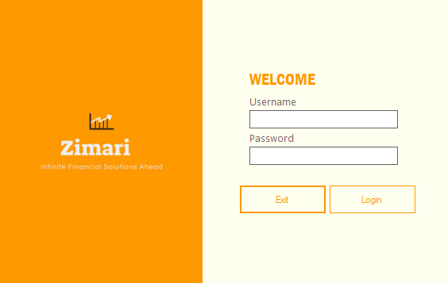
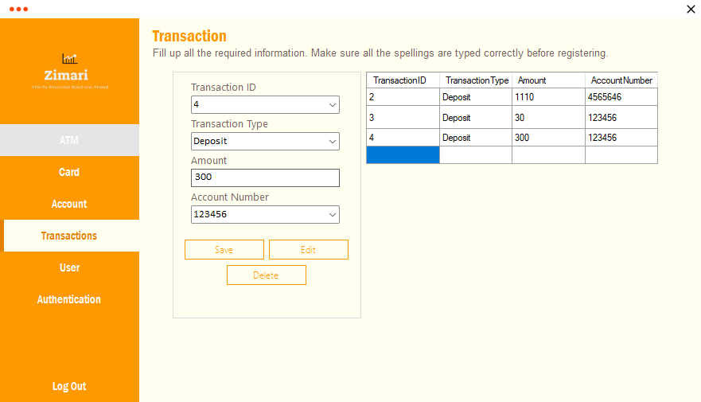
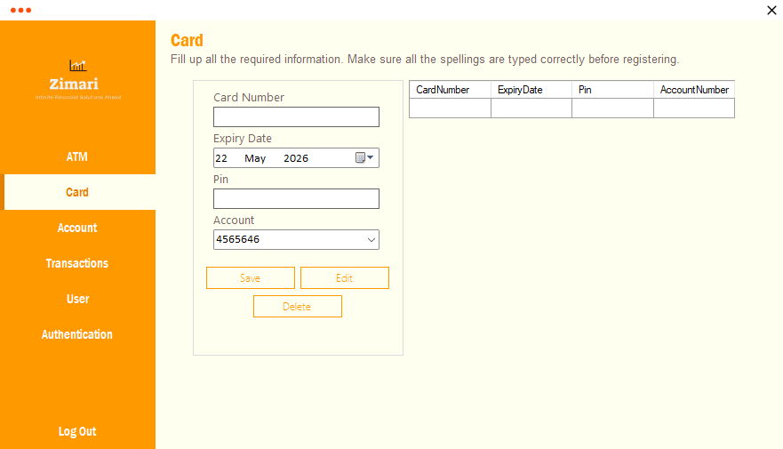

# ATM Management System

**Built:** 2022–2023  
**Tech:** C#, Windows Forms, Microsoft Access (ACE OLEDB)

Desktop ATM management demo: manage ATM terminals, cards, accounts and transactions.

## Screenshots
- Login: 
- Transactions: 
- Card management: 

## Key Features
- Secure login (local Access DB)
- ATM management (add/update/remove ATM terminals)
- Card and account management
- Transaction processing (deposits/withdrawals) with balance updates
- Basic user management and authentication

## Requirements
- Windows OS
- .NET Framework 4.5 or later
- Microsoft Access Database Engine (ACE) to support `.accdb` files

## Important files
- `ATM Management System.sln` — Visual Studio solution
- `ATM.accdb` — Microsoft Access database (place beside the built executable)
- `ATM Management System/Program.cs` — application entry point (launches `Login`)
- Key forms: `Login.cs`, `Menu.cs`, `ATM.cs`, `Transaction.cs`, `Card.cs`, `Account.cs`

## How to run
1. Open `ATM Management System.sln` in Visual Studio.
2. Build the solution (Debug or Release).
3. Copy `ATM.accdb` to the output folder (e.g., `bin\\Debug`).
4. Run the app; the `Login` form appears first.

## Database & connection notes
- Connection strings are set in code (examples: `Provider=Microsoft.ACE.OLEDB.12.0;Data Source=ATM.accdb`).
- Consider moving the connection string into `App.config` and using a configurable `DataDirectory`.

## Maintenance suggestions
- Centralize connection strings in `App.config`.
- Add stronger input validation and logging.
- Review use of `AddWithValue` for parameter types.
