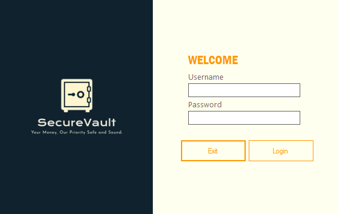
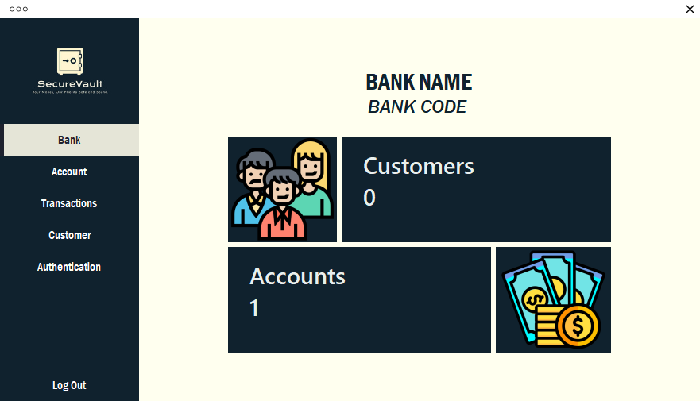
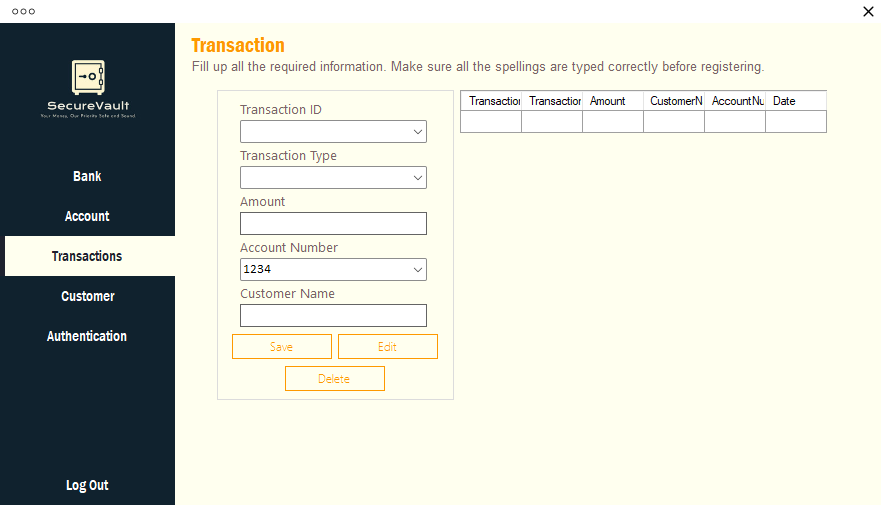

# Banking System

**Built:** 2022–2023  
**Tech:** C#, Windows Forms, Microsoft Access (ACE OLEDB)

Desktop banking demo application to manage customers, accounts, and transactions with a simple dashboard.

## Screenshots
- Login: 
- Dashboard: 
- Transactions: 

## Key Features
- Secure login (local Access DB)
- Customer management (add/update/delete customers)
- Account overview and statistics on the dashboard
- Transaction processing and history
- Simple authentication management

## Requirements
- Windows OS
- .NET Framework 4.5 or later
- Microsoft Access Database Engine (ACE) for .accdb support

## Important files
- `Banking System.sln` — Visual Studio solution
- `Bank.accdb` — Microsoft Access database (should be placed with the built EXE)
- `Banking System/Program.cs` — application entry point (launches `Login`)
- `Banking System/Login.cs` — login/connection string (`Provider=Microsoft.ACE.OLEDB.12.0;Data Source=Bank.accdb`)

## How to run
1. Open `Banking System.sln` in Visual Studio.
2. Build the solution (Debug or Release).
3. Copy `Bank.accdb` to the output folder (e.g., `bin\\Debug`).
4. Run the application; the `Login` form appears first.

## Database & connection notes
- The app expects an Access database file named `Bank.accdb` located alongside the executable.
- Connection strings are defined in code (see `Login.cs`, `Bank.cs`, `Customers.cs`, `Transaction.cs`). Consider moving the connection string into `App.config` for easier configuration.

## Where to find screenshots
- Screenshots included in the repo: `bank_login.png`, `bank_dashbrd.png`, `bank_trans.png`.

## Maintenance suggestions
- Move connection strings into `App.config` and support a configurable `DataDirectory`.
- Add input validation and consistent error handling.
- Consider parameterizing queries and reviewing use of `AddWithValue` for type-safety.
