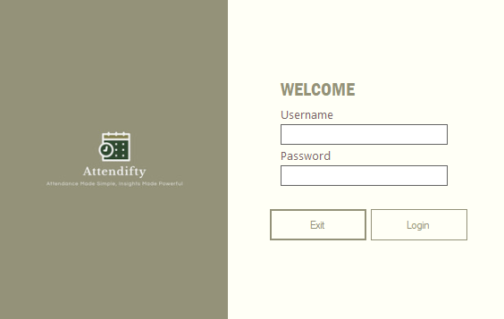
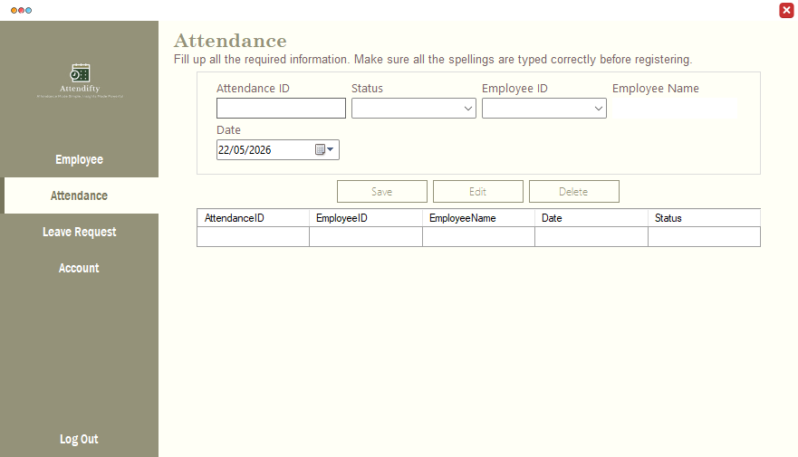
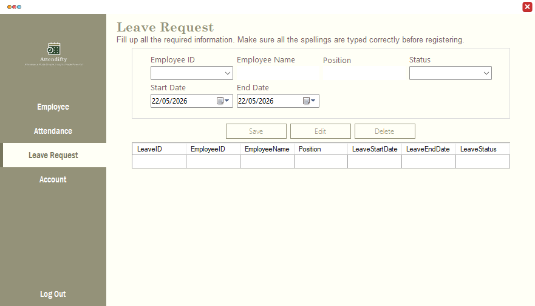

# Employee Attendance System

**Built:** 2022–2023  
**Tech:** C#, Windows Forms, Microsoft Access (ACE OLEDB)

Lightweight desktop application to manage employees, record daily attendance, and handle leave requests.

## Screenshots
- Login: 
- Attendance: 
- Leave management: 

## Key Features
- Secure login (username/password stored in the Access DB)
- Employee management (add, edit, delete employees)
- Attendance tracking (mark, edit, delete attendance records)
- Leave requests management (create, update, remove leave records)
- Simple role/account administration via the Account form

## Requirements
- Windows OS
- .NET Framework 4.5 or later
- Microsoft Access Database Engine (if you do not have MS Access installed)

## Project structure (important files)
- `Employee Attendance System.sln` — Visual Studio solution
- `EmpAttend.accdb` — Microsoft Access database file (store this alongside the built EXE)
- `Employee Attendance System/Program.cs` — application entry point (loads `Login` form)

## How to run
1. Open the solution `Employee Attendance System.sln` in Visual Studio.
2. Build the project (Debug or Release).
3. Ensure `EmpAttend.accdb` is copied to the same folder as the executable (e.g., `bin\Debug`).
4. Run the application; the `Login` form appears first.

## Database & connection notes
- The app expects an Access database named `EmpAttend.accdb`.
- Connection strings are defined in code (examples):
	- In `Login.cs`: `Provider=Microsoft.ACE.OLEDB.12.0;Data Source=EmpAttend.accdb` (resolved at runtime)
	- In other forms the code uses `|DataDirectory|` or direct `EmpAttend.accdb` paths.
- If you see provider errors, install the Microsoft Access Database Engine (ACE) appropriate for your OS and Office bitness.

## Where to find screenshots
- The repository includes sample screenshots in the project folder: `attend_login.png`, `attend_attend.png`, `attend_leave.png`.

## Notes for maintainers
- Avoid hardcoding absolute DB paths; consider moving the connection string to `App.config`.
- Add basic input validation and parameterized queries (the code already uses parameters, but review for `AddWithValue` usage).
