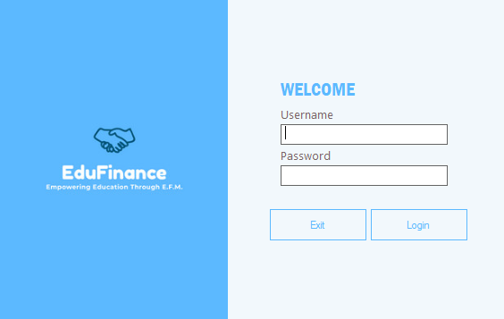
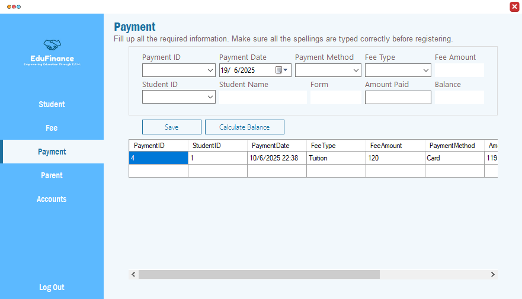

# Fees Payment System

**Built:** 2022–2023  
**Tech:** C#, Windows Forms, Microsoft Access (.accdb) via OLEDB

A school fees management application for registering fees types, recording student payments, tracking balances and generating simple payment records. Includes student and parent records, fee definitions, and a payment ledger with balance calculation.

## Screenshots
Login screen:

Fees & payment screen:

## Key features
- User login and session handling (`Login` form)
- Fees management — define fee types, amounts and due dates (`Fee` form)
- Student and parent records management (`Student`, `Parent` forms)
- Record payments — select student, fee type, payment method; calculates balance and stores payment (`Payment` form)
- Payment ledger and lookup by PaymentID
- Uses a local Access database `FeesPayment.accdb`

## Project layout
- `Program.cs` — app entry (launches `Login`)
- `Login.cs` — authentication and DB connection
- `Fee.cs` — manage fee types
- `Payment.cs` — record and list payments, calculate balance
- `Student.cs`, `Parent.cs`, `Account.cs` — supporting records and account management

## How to run (developer)
1. Requirements:
	- Windows
	- Microsoft Visual Studio (recommended)
	- .NET Framework compatible with the project
	- Microsoft Access Database Engine (ACE) for `Microsoft.ACE.OLEDB.12.0`
2. Open `Fees Payment System.sln` in Visual Studio and build.
3. Ensure `FeesPayment.accdb` is present in the runtime/output folder (usually `bin/Debug`). If missing, copy it next to the executable.
4. Run the application and log in to access fees and payment modules.

## Database
The app connects to `FeesPayment.accdb`. Key tables include `Students`, `Parents`, `Fees`, `Payment` and `[User]` for authentication.

## Notes & suggestions
- Payment calculations and balance checks are done client-side — consider server-side validation if migrating to a multi-user backend.
- Credentials are stored in the Access DB (plain text) — consider hashing for better security.

## License
For portfolio and educational use only.