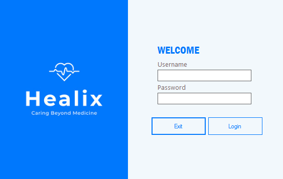
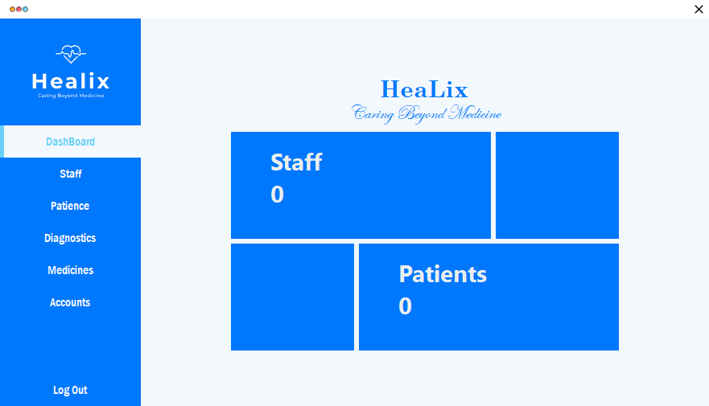
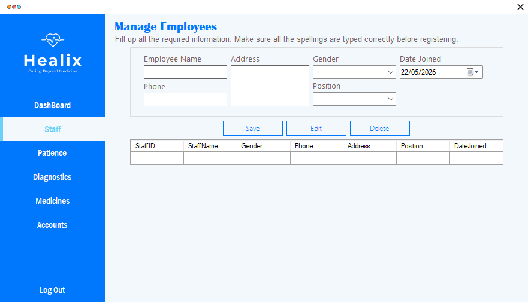

# Hospital Management System

**Built:** 2022–2023  
**Tech:** C#, Windows Forms, Microsoft Access (.accdb) via OLEDB

A desktop hospital management solution for managing patients, staff, diagnostics, medicines and basic accounts. Includes login, dashboards with counts, CRUD for patients and staff, diagnostics recording and medicines inventory.

## Screenshots
Login:

Dashboard:

Staff management:

## Key features
- User login and session handling (`Login` form)
- Dashboard with patient and staff counts
- Patient management — add/edit/delete patient records and diagnostics
- Staff management — CRUD for hospital staff (name, position, phone, join date)
- Medicines management
- Diagnostics recording and simple accounts (`Accounts` form)
- Uses local Access DB `HospitalManagement.accdb`

## Project layout
- `Program.cs` — app entry (launches `Login`)
- `Login.cs` — authentication against `HospitalManagement.accdb`
- `DashBoard.cs` — overview counts and navigation
- `Patience.cs` (Patients), `Staff.cs`, `Medicines.cs`, `Diagnostics.cs`, `Accounts.cs` — feature forms
- `Menu.cs` — main navigation host

## How to run (developer)
1. Requirements:
	- Windows
	- Microsoft Visual Studio (recommended)
	- .NET Framework compatible with the project
	- Microsoft Access Database Engine (ACE) for `Microsoft.ACE.OLEDB.12.0`
2. Open `Hospital Management System.sln` in Visual Studio and build.
3. Ensure `HospitalManagement.accdb` is present in the runtime/output folder (usually `bin/Debug`). If missing, copy it next to the executable.
4. Run the application and log in to access the dashboard and modules.

## Database
Connection strings point to `HospitalManagement.accdb` in the application's directory. Tables expected include `Patients`, `Staff`, `Medicines`, `Diagnostics` and `Users`.

## Notes & suggestions
- Parameterized queries are used in several places; continue this pattern to reduce SQL injection risk.
- Credentials appear to be stored in plain text — consider hashing passwords before saving.
- I can standardize READMEs across projects if you want a consistent template.

## License
For portfolio and educational use only.