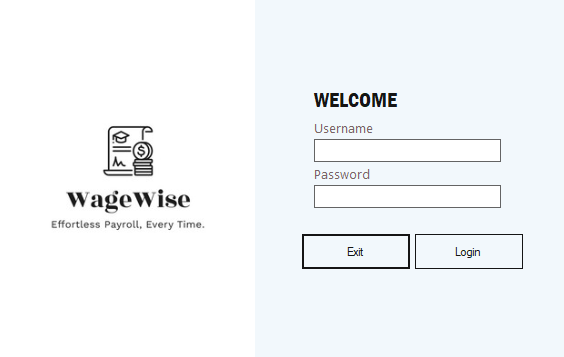
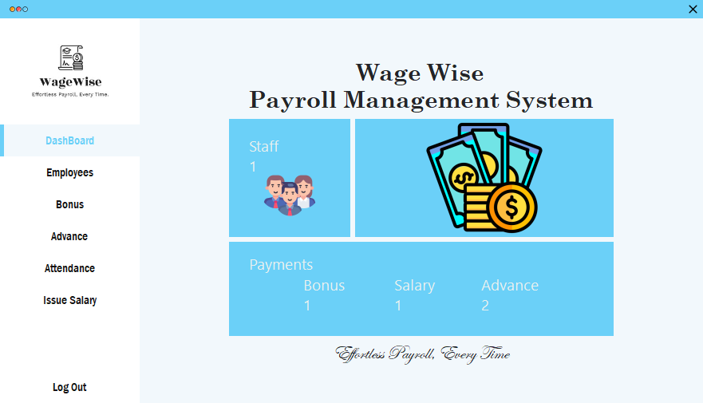
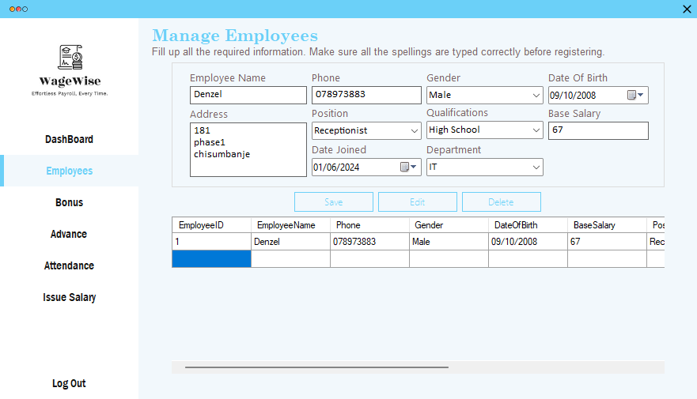
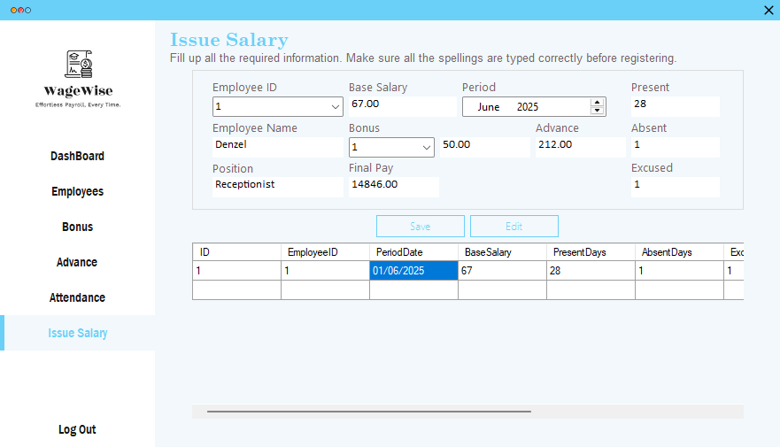
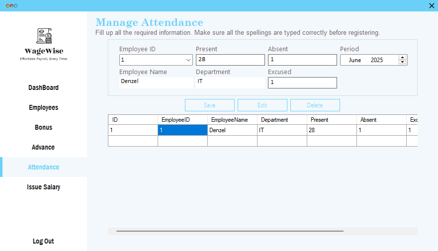

# Payroll Management System

**Built:** 2022–2023  
**Tech:** C#, Windows Forms, Microsoft Access (.accdb) via OLEDB

A desktop payroll and attendance management application. Supports employee records, attendance tracking, salary issuance, bonuses, advances and a dashboard with quick statistics.

## Screenshots
Login:

Dashboard:

Employees list / management:

Issue salary / payslip:

Attendance tracking:

## Key features
- Secure login and session handling (`Login` form)
- Employee management — add, edit and delete employee records (name, phone, DOB, position, salary, department)
- Attendance tracking and reporting
- Salary issuance — issue salary records and save payslips (`Issue Salary` form)
- Bonuses and advances management
- Dashboard with counts for employees, salaries issued, bonuses and advances
- Uses a local Access database `Payroll.accdb`

## Project layout
- `Program.cs` — app entry (launches `Login`)
- `Login.cs` — authentication and DB connection
- `DashBoard.cs` — overview counts
- `Employees.cs` — employee CRUD and data grid
- `Attendance.cs`, `Issue Salary.cs`, `Bonus.cs`, `Advance.cs` — payroll workflows

## How to run (developer)
1. Requirements:
	- Windows
	- Microsoft Visual Studio (recommended)
	- .NET Framework compatible with the project
	- Microsoft Access Database Engine (ACE) for `Microsoft.ACE.OLEDB.12.0`
2. Open `Payroll Management System.sln` in Visual Studio and build.
3. Ensure `Payroll.accdb` is present in the runtime/output folder (usually `bin/Debug`). If missing, copy it next to the executable.
4. Run the application and log in to access dashboard and payroll modules.

## Database
The application uses `Payroll.accdb`. Connection strings expect the DB in the application's base directory. Key tables include `Employees`, `IssueSalary`, `Bonus`, `Advance`, `Attendance`, and `[User]` for authentication.

## Notes & suggestions
- Many queries use parameterized commands; keep this pattern for safety against injection.
- Passwords are stored in the Access DB in plain text — consider hashing for production use.

## License
For portfolio and educational use only.