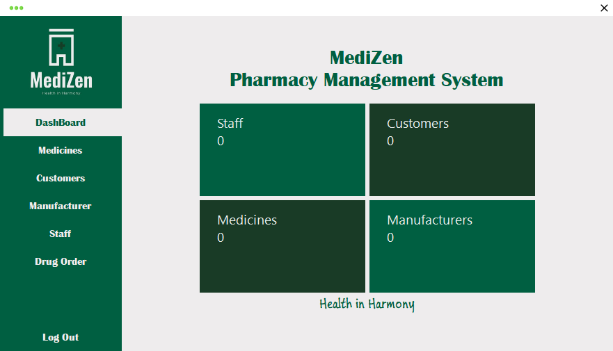
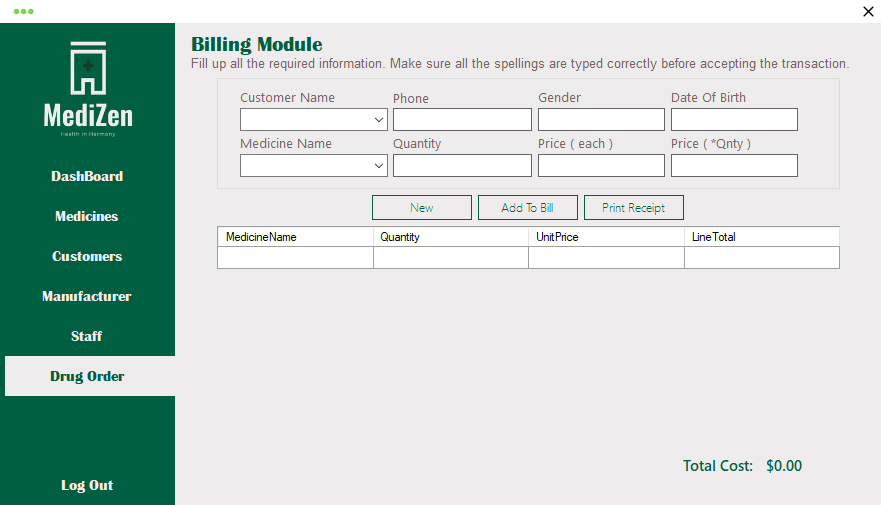

# Pharmacy Management System

**Built:** 2022–2023  
**Tech:** C#, Windows Forms, Microsoft Access (.accdb) via OLEDB

A desktop pharmacy point-of-sale and inventory system. Provides medicine inventory management, supplier/ manufacturer tracking, customer records, staff management, and a billing/ordering module with order history.

## Screenshots
Dashboard (summary counters):

Billing / Order screen:

## Key features
- Secure login and session handling (`Login` form)
- Dashboard with quick counts for customers, staff, manufacturers and medicines
- Medicines inventory — add/edit/delete medicines, manage quantities and prices
- Manufacturers and suppliers management
- Customer management (contact & DOB) and staff management
- Billing / Orders — create transactions, add multiple items to a bill, save order and order items, print receipts
- Basic drug ordering module
- Uses a local Access database `Pharmacy.accdb`

## Project layout
- `Program.cs` — app entry (launches `Login`)
- `Login.cs` — authentication and DB connection
- `DashBoard.cs` — summary counters and top-level navigation
- `Medicines.cs`, `Manufacturer.cs`, `Customer.cs`, `Staff.cs` — CRUD screens
- `Drug_Order.cs` — billing/order logic and receipt saving (Orders + OrderItems)
- `Menu.cs` — main navigation/host for forms

## How to run (developer)
1. Requirements:
	- Windows
	- Microsoft Visual Studio (recommended)
	- .NET Framework compatible with the project
	- Microsoft Access Database Engine (ACE) for `Microsoft.ACE.OLEDB.12.0`
2. Open `Pharmacy Management System.sln` in Visual Studio and build.
3. Ensure `Pharmacy.accdb` is present in the runtime/output folder (the project expects it in the app directory; it's usually included under `bin/Debug`). If missing, copy it into the same folder as the built executable.
4. Run the application; log in and use the menu to access Dashboard, Medicines, Customers, Billing, etc.

## Database
The app uses `Pharmacy.accdb`. Connection strings point to the DB file in the application's base directory. Key tables include `Medicines`, `Manufacturers`, `Customers`, `Staffs`, `Orders`, and `OrderItems`.

## Notes & suggestions
- Input validation exists but could be hardened (e.g., numeric parsing, try-parse usage is present in some places).
- Passwords are stored in the Access DB in plain text — consider hashing for production use.
- Consider adding stock-level alerts and transaction rollbacks for partially-failed billing operations.

## License
For portfolio and educational use only.