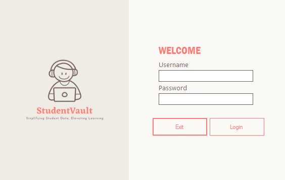
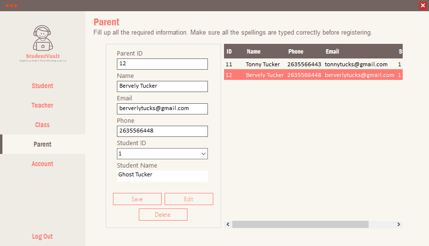
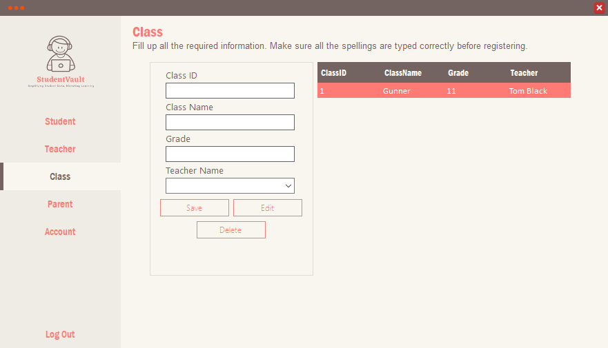

# Student Information System

**Built:** 2022–2023  
**Tech:** C#, Windows Forms, Microsoft Access (.accdb) via OLEDB

A desktop application to manage student records, classes, teachers, parents and user accounts. Includes login authentication, CRUD operations for students, teachers and classes, and simple account management.

## Screenshots
Login screen:

Student view / management:

Teacher view / management:

## Key features
- User authentication (login) with account management (`Account` form)
- Manage Students — add, edit, delete student records (Name, Phone, Email, Class)
- Manage Teachers — CRUD for teacher details
- Manage Classes — assign students to classes (class selection used in `Student` form)
- Parent records management
- Uses a local Access database `StudentInfo.accdb` (connection uses `|DataDirectory|` or base directory)

## Project layout
- `Program.cs` — application entry (launches `Login`)
- `Login.cs` — user authentication and DB connection
- `Menu.cs` — main navigation hosting `Student`, `Teacher`, `Class`, `Parent`, `Account` forms
- `Student.cs`, `Teacher.cs`, `Class.cs`, `Parent.cs`, `Account.cs` — feature implementations

## How to run (developer)
1. Requirements:
	- Windows
	- Microsoft Visual Studio (recommended)
	- .NET Framework compatible with the project
	- Microsoft Access Database Engine (ACE) for `Microsoft.ACE.OLEDB.12.0`
2. Open `Student Information System.sln` in Visual Studio and build.
3. Ensure `StudentInfo.accdb` is present in the runtime/output folder. The project expects the DB file in the application's folder (or uses `|DataDirectory|`). If missing, copy `StudentInfo.accdb` into the same folder as the built executable (typically `bin/Debug`).
4. Run the application; use the login screen to authenticate and access the menu.

## Database
The app uses `StudentInfo.accdb`. Connection strings in source use either `|DataDirectory|\StudentInfo.accdb` or the application base directory. Tables include `Students`, `Classes`, `Teachers`, `Parents`, and `[User]` for authentication.

## Notes & suggestions
- Passwords appear stored as plain text in the DB — consider hashing for better security.
- The app uses parameterized queries in many places which helps reduce SQL injection risk.
- I can standardize README formatting across all projects if you want a uniform look.

## License
For portfolio and educational use only.