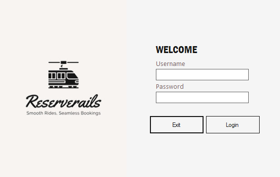
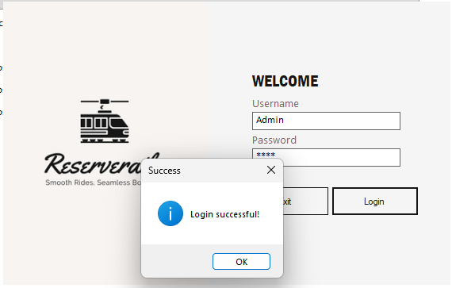
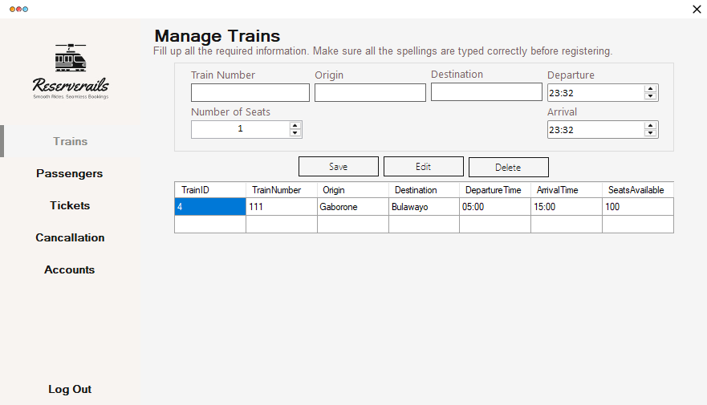
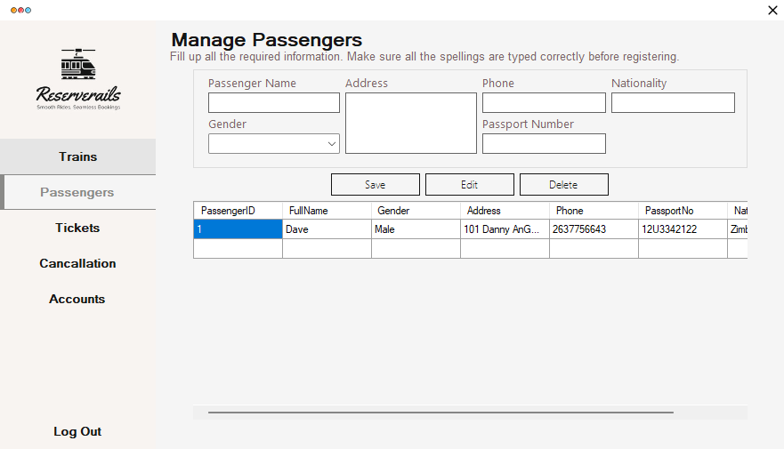
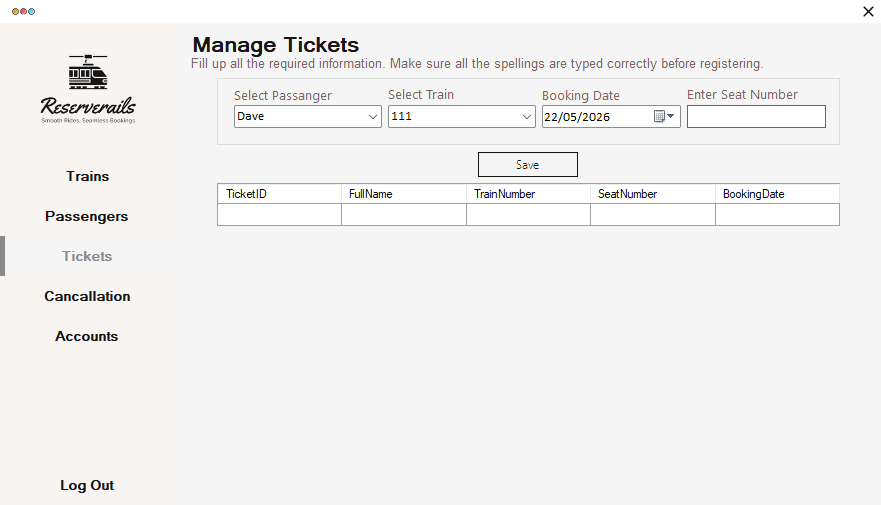

# Train Ticket Reservation System

**Built:** 2022–2023  
**Tech:** C#, Windows Forms, Microsoft Access (.accdb) via OLEDB

A small desktop application for managing train schedules, passengers and ticket bookings. Features include user login, CRUD for trains and passengers, ticket booking with seat-duplication protection, booking cancellations, and simple account management.

## Screenshots
Login screen:

Login success:

Manage Trains:

Manage Passengers:

Book Ticket:

## Key features
- User authentication (login) with account management (`Accounts` form)
- Manage Trains — add, edit, delete trains (Train number, origin, destination, departure/arrival times, seats available)
- Manage Passengers — add, edit, delete passenger records (name, gender, address, phone, passport, nationality)
- Ticket booking — select passenger and train, choose seat number and booking date; prevents duplicate seat bookings on the same train
- Cancellation management — cancel bookings and record cancellation reasons
- Uses a local Access database file `Train.accdb`

## Project layout
- `Program.cs` — app entry, launches `Login` form
- `Login.cs` — authentication and connection to `Train.accdb`
- `Menu.cs` — main navigation; hosts `Train`, `Passangers`, `Ticket`, `Cancellation`, `Accounts` forms
- `Train.cs`, `Passangers.cs`, `Ticket.cs`, `Cancellation.cs`, `Accounts.cs` — core feature implementations

## How to run (developer)
1. Requirements:
	- Windows
	- Microsoft Visual Studio (recommended)
	- .NET Framework (project targets .NET Framework; use Visual Studio to restore appropriate target)
	- Microsoft Access Database Engine (ACE) installed to support `Microsoft.ACE.OLEDB.12.0` provider
2. Open the solution file `Train Ticket Reservation System.sln` in Visual Studio.
3. Build the solution.
4. Ensure the database file `Train.accdb` is present in the output folder (the project already includes `Train.accdb` under `bin/Debug`). If missing, copy `Train.accdb` into the same folder as the built executable.
5. Run the project (Start Debugging or run the generated `.exe`).

## Database
The application uses `Train.accdb` (Access). Connection strings in the source expect `Train.accdb` to be in the application's runtime folder. The provider used is `Microsoft.ACE.OLEDB.12.0`.

## Notes & suggestions
- Passwords are stored in plain text in the Access DB by default — consider hashing before saving for better security.
- The app uses parameterized queries in many places, which helps protect against SQL injection.
- If you want, I can create a consistent README template and update the other project READMEs the same way.

## License
For portfolio and educational use only.