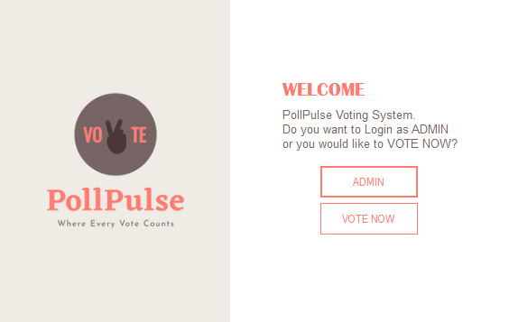
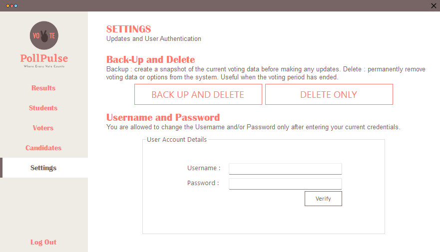

# Voting System (PollPulse)

**Built:** 2022–2023  
**Tech:** C#, Windows Forms, Microsoft Access (.accdb) via OLEDB

A desktop voting management application for administering elections, registering voters and candidates, casting votes, and printing/clearing results. Includes separate admin and voter flows and a simple settings panel for credential management.

## Screenshots
Welcome / first page:

Settings (backup / clear results):

## Key features
- Separate Admin and Voter login flows (`AdminLGN`, `VoterLGN`)
- Manage Candidates, Voters and Students (CRUD)
- Vote casting with vote recording and results aggregation
- Results printing / backup and optional clearing of results (`Settings` form)
- Simple credential update (change admin username/password)
- Uses a local Access database `Vote.accdb`

## Project layout
- `Program.cs` — app entry, launches `Welcome` form
- `Welcome.cs` — choose Admin or Voter paths
- `AdminLGN.cs`, `VoterLGN.cs` — login forms
- `Vote.cs`, `Candidates.cs`, `Voters.cs`, `Students.cs`, `Results.cs`, `FnlResults.cs` — core functionality
- `Settings.cs` — print/backup results, update admin credentials, clear tables

## How to run (developer)
1. Requirements:
	- Windows
	- Microsoft Visual Studio (recommended)
	- .NET Framework (project targets .NET Framework)
	- Microsoft Access Database Engine (ACE) for `Microsoft.ACE.OLEDB.12.0`
2. Open `Voting System.sln` in Visual Studio and build.
3. Ensure `Vote.accdb` (the Access DB) is present in the runtime/output folder (the project typically includes it under `bin/Debug`). If missing, copy it next to the executable.
4. Run the application; use the Admin or Voter login from the welcome screen.

## Database
The app connects to `Vote.accdb` using the ACE OLEDB provider. The connection string in `Settings.cs` points to `Vote.accdb` in the application's base directory.

## Notes & suggestions
- Credentials are stored in the Access DB (plain text) — consider hashing passwords for improved security.
- The `Settings` form includes a print preview and an optional "clear results" function — use with caution (clears `Candidates`, `Votes`, `VotesRate` tables).
- I can standardize README formatting across all projects if you want.

## License
For portfolio and educational use only.